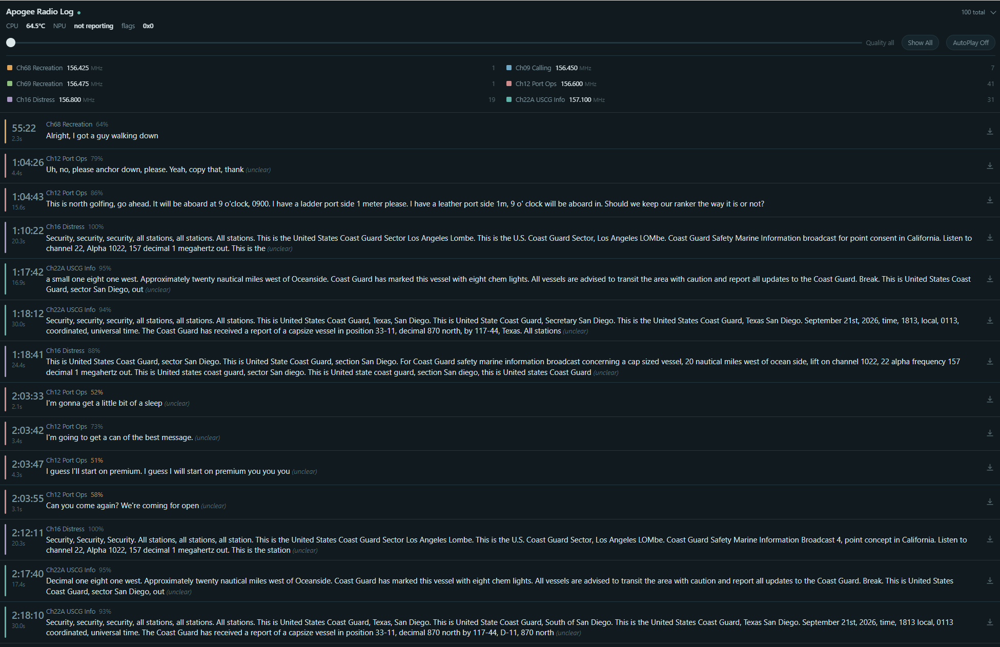

# Radio Log

A multi-channel VHF watchkeeper for a Raspberry Pi 5 and a $40 SDR dongle. It
listens to six or more channels **at once**, records every transmission as a
separate audio file, transcribes it, and serves a phone-friendly log you can
read from the cockpit or anywhere on your network.



## Why not a scanner?

A scanner stops on one channel at a time. While it is listening to the Coast
Guard, it is deaf to the harbour calling you on 12.

This receives the entire 2 MHz band continuously and splits it into channels in
software, so nothing is missed while something else is talking. Every channel
is monitored simultaneously, every transmission is captured, and the log tells
you what happened while you were away from the radio.

It is a **receiver only**. It cannot transmit, and it is not a substitute for
keeping a watch on 16.

## What you get

- **Every transmission recorded** and playable from the browser, complete with
  a download button for the audio and transcript together.
- **Automatic transcription** with `faster-whisper`, running locally — no
  internet, no cloud, no account.
- **A readability score** (0–100) per message, derived from the spectral
  flatness of the audio, with a slider to hide the noise-only captures.
- **Distress flagging** on keywords, so a mayday stands out in the log.
- **Hallucination filtering.** Whisper was trained on scraped subtitles and
  happily emits `[engine revving]`, `Thanks for watching!` and endless repeats
  of the last phrase on noisy input. Six classes of that are stripped without
  discarding the real words around them.
- **Works offline.** The page has no webfonts and no CDN links, because a boat
  at anchor has no connectivity.

Two bands are supported and behave quite differently:

| Band | Frequencies | Mode | Typical traffic |
|---|---|---|---|
| Marine VHF | 156–158 MHz | Narrowband FM | Vessels, harbour control, Coast Guard |
| Aviation | 118–137 MHz | AM | Air traffic control |

---

## Hardware

Everything below is what the system was developed and measured on. Approximate
US prices as of late 2026.

### What you need

| Part | What to buy | ~Price | Notes |
|---|---|---|---|
| **Computer** | Raspberry Pi 5, 8 GB | $80 | 16 GB was used here but is not needed. **4 GB is too small** once the speech model is loaded. |
| **Receiver** | RTL-SDR Blog V4 | $40 | Get this exact one. The 1 PPM TCXO means you can tune to a channel and stay there; cheap generic dongles drift enough to walk off a 12.5 kHz channel as they warm up. Comes with a dipole antenna kit. |
| **Cooling** | Active cooler **and** a metal case | $25 | **Not optional** — see below. |
| **Storage** | 32 GB+ A2 microSD | $12 | Or boot from an NVMe HAT if you have one. Recordings are kept in RAM to spare the card. |
| **Power** | Official 27 W USB-C supply | $14 | An underpowered supply causes throttling that looks exactly like overheating. |
| **Antenna** | A real marine VHF antenna | $30–150 | The single biggest factor in how well any of this works. |

Rough total: **$200–300** depending on the antenna.

### On cooling — read this one

The transcriber pins two cores for as long as there is a backlog, and a bare Pi
5 doing that will hit its 80 °C throttle point and stay there. Throttling slows
the DSP as well as the transcriber, and a DSP that falls behind real time drops
audio chunks — you lose transmissions.

Get the **active cooler and the metal case**, not one or the other. The software
also includes a thermal governor that pauses transcription above a configurable
temperature, but that is a backstop, not a substitute for a heatsink.

### On the antenna — read this one too

This is not the usual hand-waving about antennas. It was measured.

Transcripts recorded eleven miles inland with the supplied dipole were largely
unusable **regardless of which speech model ran**. The same code, unchanged, at
a dock with the same dipole produced coherent Coast Guard and harbour traffic.
Switching between `tiny.en`, `base.en`, `small.en` and `medium.en` moved the
word error rate by a few percent. Moving the antenna moved it from unusable to
good.

In order of what actually helps:

1. **Height and a clear view of the water.** VHF is line of sight.
2. **Outside, not inside.** A cabin, and especially a metal or foil-lined one,
   costs you more than any software setting will win back.
3. **A proper marine antenna** on decent coax, over the supplied dipole.
4. Only then, anything in this repository.

If your transcripts are poor, the answer is almost never in the config file.

### What *not* to buy

**The Raspberry Pi AI HAT+ 2 (Hailo-10H NPU) — $110.** It was bought,
installed, benchmarked against a hand-transcribed ground-truth corpus, and
rejected. `base` is the largest Whisper variant the Hailo tooling offers, and
both `tiny` variants return punctuation soup because their decoder architecture
is mishandled by the current runtime. The NPU does run about 28 °C cooler and
leaves the CPU free, but it cannot match `small.en` on noisy radio audio, and
accuracy is the whole point.

It may yet earn its place at *classification* — triaging messages by importance,
pulling out vessel names and channel numbers — which is beyond the Pi's cores
and cannot fabricate a transcript. That is not built.

---

## Installing

Assumes a fresh Raspberry Pi OS (Debian 13 "trixie") with SSH enabled.

```bash
# 1. The SDR tools (rtl_sdr is a system package, not a Python one)
sudo apt update
sudo apt install -y rtl-sdr sqlite3 python3-venv tmux

# 2. Confirm the dongle is seen. "No E4000 tuner found" is expected and
#    harmless -- the V4 has an R828D.
rtl_test -t

# 3. The Python side, in its own virtualenv
python3 -m venv ~/venv_wx
~/venv_wx/bin/pip install -r requirements.txt

# 4. The program files
cp watchkeeper.py webui.py watchkeeper.toml docs.html refresh.sh ~/

# 5. Recordings in RAM, to spare the SD card (about 12 MB of tmpfs)
mkdir -p ~/watchkeeper/audio
echo "tmpfs $HOME/watchkeeper/audio tmpfs defaults,noatime,nosuid,size=256M,mode=0755,uid=$(id -u),gid=$(id -g),nofail 0 0" | sudo tee -a /etc/fstab
sudo systemctl daemon-reload
sudo mount ~/watchkeeper/audio
```

Then run it:

```bash
~/venv_wx/bin/python ~/watchkeeper.py --list-presets
~/venv_wx/bin/python ~/watchkeeper.py --preset marine   # the receiver
~/venv_wx/bin/python ~/webui.py                         # the web interface
```

Open `http://<the-pi>:8080`.

The first run downloads the speech model (about 250 MB) and calibrates the
squelch — nothing records for the first twenty seconds or so, which is normal.

### Running at boot

```bash
sudo cp systemd/watchkeeper@.service systemd/watchkeeper-web@.service /etc/systemd/system/
sudo systemctl daemon-reload
sudo systemctl enable --now watchkeeper@$USER watchkeeper-web@$USER
journalctl -u watchkeeper@$USER -f
```

The units are templated on the username, so `watchkeeper@pi` and
`watchkeeper@yourname` both work without editing paths.

> **One radio, one program.** An enabled service holds the dongle from power-on.
> `rtl_power`, `gqrx` and this program's own `--record` will all fail to open
> the device until you `sudo systemctl stop watchkeeper@$USER`.

---

## Configuring it for where you are

Everything lives in `watchkeeper.toml` — you should never need to edit the
program. Name your station, then define the channels you care about:

```toml
[radio]
station_name = "Radio Log"    # the title of the web page

[preset.marine]
center_hz = 156762500
mode = "nfm"
channels = [
  { name = "Ch09 Calling",    freq = 156450000 },
  { name = "Ch12 Port Ops",   freq = 156600000 },
  { name = "Ch16 Distress",   freq = 156800000, distress = true },
  { name = "Ch22A USCG Info", freq = 157100000 },
  { name = "ref-a", freq = 156237500, role = "reference" },
]
```

Two rules, both checked at startup:

1. Every channel must sit within about ±800 kHz of `center_hz`. The tuner rolls
   off near the edges of the 2.048 MHz window.
2. Put `center_hz` where no channel sits — the tuner leaks a DC spike there.

**Reference channels** (`role = "reference"`) are frequencies you expect to be
permanently silent. The program measures the noise floor on them to calibrate
every squelch threshold automatically, and raises an alarm if their power
collapses — which is what a disconnected antenna looks like.

Six presets ship as examples: three marine, two SoCal aviation, and one for
weather and AIS.

### Surveying your location

Marine channel usage is intensely local. Before committing to a channel list,
look at what is actually busy where you are:

```bash
sudo systemctl stop watchkeeper@$USER          # release the radio first
rtl_power -f 156M:158M:6250 -g 30 -i 60 -e 2h scan.csv
```

> **A survey cannot tell traffic from interference.** In development, the two
> strongest "channels" in a two-hour marina survey turned out to be static.
> The tell was a suspiciously constant signal level and sub-two-second bursts.
> Listen to a candidate channel before you build a preset around it.

---

## How it works, briefly

```
RTL-SDR ─► 2.048 MSPS I/Q ─► polyphase channelizer ─► N × 16 kHz audio
                                                          │
                              per-channel squelch ◄────────┤
                                                          ▼
                                    WAV (tmpfs) ─► faster-whisper ─► SQLite
                                                                       │
                                                        web interface ◄┘
```

The decimation chain is 2.048 MHz → 128 kHz → 32 kHz IF → 16 kHz audio, with
each channel mixed down by an oscillator computed once and reused, which is why
channel offsets must be whole multiples of 4 Hz.

Squelch is two entirely different problems. On **AM** it compares carrier power
against a calibrated floor. On **FM** that does not work at all: the capture
effect means demodulated audio comes out at the same level whether or not a
carrier is present. FM squelch instead measures high-frequency noise on the
discriminator output — about 0.86 when idle, near zero with a carrier — which
is amplitude-independent and far more reliable.

`docs.html` is a 40-page operator and maintenance guide covering all of this in
detail: the signal path, the hallucination filters, the quality score, the CLI,
routine administration, and troubleshooting. It is served at `/docs` by the web
interface, and there is a link at the bottom of every page.

---

## Honest limitations

- **Transcripts are a convenience, not a record.** They come from a speech model
  working on noisy radio audio and are sometimes wrong in ways that read
  perfectly well. Every message can be played back, and on anything that matters
  you should listen. The design consistently prefers a garbled transcript over a
  plausible invented one.
- **Reception governs everything.** See the antenna section above.
- **Recordings live in RAM and do not survive a reboot.** This is deliberate —
  audio is about 1.25 MB/min against roughly 10 KB/min of database, so putting
  it on tmpfs removes ~99% of the writes to the SD card. The database persists;
  rows whose audio has gone are dropped at startup.
- **One dongle, one 2 MHz window.** You cannot watch marine and aviation at the
  same time without a second receiver.
- **Digital traffic is not decoded.** AIS and any DSC or digital voice on the
  band will be captured as noise. There is a `wx` preset that captures AIS audio
  but it does not decode it.

## Repository layout

| Path | What it is |
|---|---|
| `watchkeeper.py` | The receiver: DSP, squelch, recording, transcription, storage |
| `webui.py` | The web interface — standard library only, no framework |
| `watchkeeper.toml` | All configuration: presets, channels, thresholds |
| `docs.html` | Operator and maintenance guide, served at `/docs` |
| `test_dsp.py` | DSP test suite — run after any change to the signal path |
| `systemd/` | Templated units for running at boot |
| `refresh.sh` | Wipes the log and recordings for a clean test |

## Contributing

Issues and pull requests welcome, particularly:

- Presets for other regions — if you have surveyed your area and know which
  channels are genuinely busy, that is useful to others.
- Reception reports. The relationship between antenna setup and transcription
  quality is the most valuable thing to document, and one boat is a small
  sample.

Run `python3 test_dsp.py` before submitting anything that touches the signal
path; it should end `all DSP tests passed`.

## License

MIT — see [LICENSE](LICENSE).

Built with [faster-whisper](https://github.com/SYSTRAN/faster-whisper) and
[librtlsdr](https://github.com/librtlsdr/librtlsdr). Not affiliated with, or
endorsed by, any marine authority. **Receive only — always keep a proper watch.**
